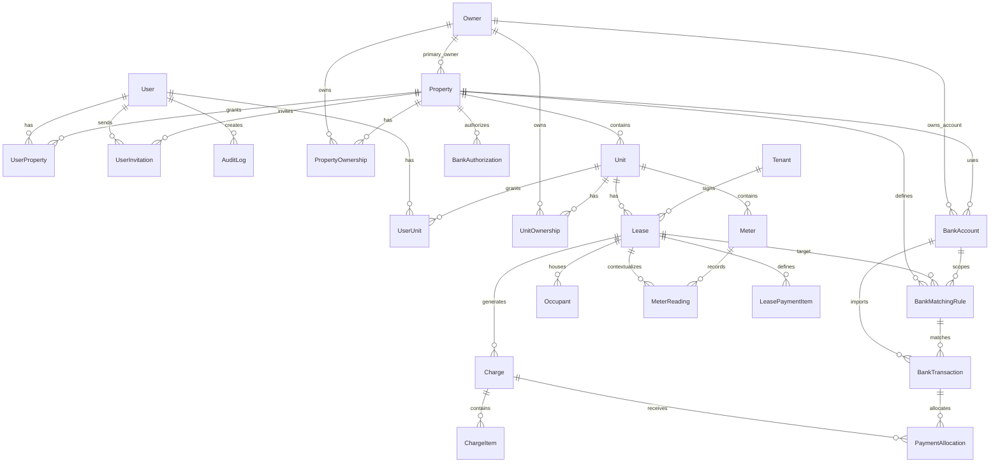

# FlatCloud Rent – architektura projektu

> Tento dokument je živá technická dokumentace. Při každé změně aplikace je nutné aktualizovat relevantní část: databázi, vazby, oprávnění, route, provozní konvence nebo přijatá rozhodnutí.

**Aktualizováno:** 17. 7. 2026  
**Výchozí stav:** FlatCloud Rent V15  
**Databázové schéma:** `prisma/schema.prisma`

## 1. Účel a základní principy

FlatCloud Rent je interní systém FlatCloud pro správu nájemních nemovitostí. Není navržen jako veřejný SaaS.

Priorita projektu:

1. jednoduchost práce,
2. rychlost běžných operací,
3. stabilita,
4. intuitivní UX,
5. minimální zásahy do fungující architektury.

Základní hierarchie domény:

```text
Portfolio
└── Nemovitost
    └── Jednotka
        ├── Vlastník jednotky
        ├── Měřidla a odečty
        └── Smlouva
            ├── Nájemník
            ├── Další osoby v bytě
            ├── Pravidelné položky
            └── Měsíční předpisy
                └── Alokované platby
```

Bankovní tok:

```text
Bankovní autorizace
└── Bankovní účet
    └── Bankovní transakce
        ├── Párovací pravidlo / návrh smlouvy
        └── Alokace na měsíční předpis
```

## 2. Technologie a provoz

- Next.js 16, App Router
- React 19
- TypeScript se zapnutým `strict`
- Prisma 6
- PostgreSQL
- Render Web Service + Render Cron Job
- GitHub, větev `main`
- Node.js 22.23.1 na Renderu
- SMTP přes Nodemailer
- JWT session v HTTP-only cookie

Produkční build:

```bash
npm ci --no-audit --no-fund
npm run build
```

Skript `npm run build` spouští:

```bash
prisma generate
next build
```

Pre-deploy:

```bash
npm run db:migrate
npm run db:bootstrap
```

Cron synchronizace bank běží každou hodinu a podle globálního nastavení vybírá pouze účty, u kterých již uplynul požadovaný interval.

## 3. Struktura repozitáře

```text
app/
├── api/                         API route handlery
├── login/                       přihlášení
├── portfolio/                   hlavní portfolio dashboard a KPI vstupy
├── reporty/                     portfolio reporty a dlužnické saldo
├── platby/                      globální zadání ruční platby
├── nemovitosti/                 detail objektu, technický pasport, jednotky, smlouvy a platby
├── uzivatele/                   správa uživatelů a avatarů
├── vlastnici/                   správa vlastníků / SPV / SVJ
├── nastaveni/                   globální nastavení
├── ucet/                        profil přihlášeného uživatele
└── pozvanka/                    přijetí pozvánky

components/
├── Shell.tsx                    hlavní layout, navigace a globální akce
├── PropertySubnav.tsx           navigace detailu nemovitosti
├── LeaseCoreFields.tsx          společná pole smlouvy, doba trvání a návrh VS
├── TenantFields.tsx             kontaktní pole fyzické / právnické osoby
├── ReportChart.tsx              serverově vykreslený SVG graf předpisů a inkasa
├── UserAvatar.tsx               avatar s fallbackem na iniciály
└── FormUi.tsx                   sdílené formulářové komponenty

lib/
├── access.ts                    filtrování objektů a jednotek podle přístupu
├── auth.ts                      session, uživatel, role
├── management.ts               permission guardy a audit
├── db.ts                        líně inicializovaný singleton PrismaClient
├── charges.ts                   jednotná logika uhrazení, splatnosti a dluhu
├── variable-symbol.ts           návrh, validace a transakční kontrola VS
├── forms.ts                     parsování FormData
├── route-response.ts            redirect + flash zprávy
├── matching.ts                  párovací engine plateb
├── period.ts                    období a splatnosti předpisů
├── settings.ts                  globální nastavení synchronizace
├── property-technical.ts        parser a konvence technického pasportu
├── banking/                     adaptéry a synchronizace bank
└── ...

prisma/
├── schema.prisma               jediný zdroj databázového modelu
├── migrations/                 sekvenční nedestruktivní migrace
├── bootstrap.ts                vytvoření / obnova prvního administrátora
└── seed.ts                     volitelná demo data

scripts/
└── banking-cron.ts             hodinová bankovní synchronizace

public/
└── flatcloud-logo.png          logo aplikace
```

## 4. Aplikační vrstvy a tok požadavku

### Serverové stránky

Stránky v `app/` jsou převážně async Server Components. Datové stránky používají:

```ts
export const dynamic = "force-dynamic";
```

Obvyklý tok:

1. `requireUser()` načte přihlášeného uživatele.
2. `requirePropertyAccess()` nebo `requireUnitAccess()` omezí data.
3. Prisma načte entity včetně potřebných vazeb.
4. Server Component vykreslí HTML.

### Zápis dat

Aplikace nepoužívá samostatnou klientskou datovou vrstvu. Formuláře odesílají běžný `POST` do `app/api/**/route.ts`.

Obvyklý tok API route:

1. ověřit session a oprávnění,
2. načíst `FormData`,
3. parsovat hodnoty přes `lib/forms.ts`,
4. ověřit vazbu entity na nemovitost / jednotku,
5. provést Prisma transakci nebo CRUD operaci,
6. uložit auditní záznam,
7. vrátit redirect HTTP 303 přes `go()` / `goWithMessage()`.

Úspěch a chyba se zobrazují přes query parametry `ok` a `error` a komponentu `Flash`.

### Formulářové konvence

- částky se v databázi ukládají jako celé haléře v polích `*Cents`,
- desetinné hodnoty formuláře přijímají tečku i čárku,
- datum formuláře se převádí na UTC v poledne, aby se omezily posuny data,
- enum hodnoty se ukládají v angličtině a zobrazují přes `lib/labels.ts`,
- `Field.min` a `Field.max` jsou čísla, `Field.step` je string.

## 5. Databázový model

### 5.1 Identity a oprávnění

#### `User`

Uživatelský účet aplikace.

Důležitá pole:

- `email` – unikátní login,
- `passwordHash` – bcrypt hash,
- `role` – globální role,
- `active` – možnost přihlášení,
- `allProperties` – přístup ke všem současným i budoucím objektům,
- kontaktní údaje,
- volitelný avatar v `avatarData` a jeho typ v `avatarMimeType`,
- vazby na objekty, jednotky, bankovní připojení a audit.

Avatar je omezen aplikační validací na PNG/JPG/WebP do 2 MB. Ukládá se v PostgreSQL, protože běžný lokální disk webové služby není považován za trvalé úložiště. Bez obrázku se vykreslují iniciály.

#### `UserProperty`

Přímé oprávnění uživatele k celé nemovitosti.

- složený klíč `userId + propertyId`,
- oprávnění `VIEW`, `EDIT`, `ADMIN`.

#### `UserUnit`

Existující model V12 pro explicitní přístup uživatelského účtu ke konkrétní jednotce.

- složený klíč `userId + unitId`,
- oprávnění `VIEW`, `EDIT`, `ADMIN`.

**Konvence:** nepřidávat další paralelní tabulku typu `UserUnitAccess`. `UserUnit` je technické oprávnění účtu, nikoli zdroj vlastnictví jednotky.

#### `UserInvitation`

Jednorázová pozvánka do aplikace.

- ukládá pouze hash tokenu,
- platnost je časově omezená,
- podporuje celý objekt, více objektů, konkrétní jednotky nebo všechna portfolia,
- stav `PENDING`, `ACCEPTED`, `REVOKED`, `EXPIRED`.

### 5.2 Vlastnictví a nemovitosti

#### `Owner`

Vlastník, fyzická osoba, společnost, SPV nebo evidenční SVJ.

Je společným zdrojem pro:

- hlavního vlastníka nemovitosti,
- komunikačního vlastníka,
- spoluvlastnictví nemovitosti,
- vlastnictví jednotek,
- přiřazení bankovního účtu.

#### `Property`

Nemovitost / spravovaný objekt.

Hlavní vazby:

- povinný evidenční vlastník `owner`,
- volitelný komunikační vlastník,
- volitelný správce `manager`,
- vlastnický režim `WHOLE_OBJECT`, `UNIT_BASED`, `SVJ`,
- jednotky,
- bankovní účty,
- párovací pravidla,
- uživatelská oprávnění a pozvánky,
- strukturovaný technický pasport v `technicalData` (`JSONB`).

`technicalData` je záměrně jeden objekt místo sítě nových tabulek. Obsahuje identifikaci budovy, konstrukci, roky, plochy, energetiku, vytápění, pojištění, katastr a provozní poznámku. Dokumenty, revize a servisní události do tohoto JSON nepatří; případný budoucí dokumentový modul vyžaduje samostatné schválení modelu.

#### `PropertyOwnership`

Evidence více vlastníků jednoho objektu.

- unikátní kombinace `propertyId + ownerId`,
- podíl se ukládá v basis points,
- podíly se v aktuálním UI nezobrazují, ale model zůstává zachován.

#### `Unit`

Bytová nebo nebytová jednotka v nemovitosti.

- označení je unikátní v rámci nemovitosti,
- typ, stav, podlaží, plocha a poznámka,
- vazba na vlastnictví, uživatelský přístup, smlouvy a měřidla,
- měřidla zůstávají u jednotky i v době bez aktivní smlouvy.

#### `UnitOwnership`

Kanonický zdroj informace, kdo vlastní konkrétní jednotku.

```text
Owner → UnitOwnership → Unit
```

**Rozhodnutí:** oprávnění nebo zobrazení založené na vlastnictví se má odvozovat z této vazby. Nevytvářet novou M:N tabulku pro vlastnický přístup.

### 5.3 Nájemní vztah a předpisy

#### `Tenant`

Nájemník může být fyzická nebo právnická osoba.

Společná pole obsahují jméno / název, telefon, poznámku, aktivní stav a seznam známých účtů plátce `payerAccounts`.

Fyzická osoba používá zejména:

- e-mail,
- adresu trvalého pobytu,
- korespondenční adresu.

Právnická osoba používá zejména:

- IČO,
- fakturační adresu,
- korespondenční adresu,
- fakturační e-mail,
- komunikační e-mail.

Původní obecná pole `email` a `address` zůstávají kvůli kompatibilitě a API je průběžně synchronizuje s novými podrobnějšími poli.

#### `Lease`

Nájemní smlouva vždy patří jedné jednotce a jednomu nájemníkovi.

- smlouva na dobu určitou má `endDate`, smlouva na dobu neurčitou má `endDate = null`,
- den splatnosti,
- variabilní symbol,
- nájem dopředně nebo zpětně,
- základní částky nájmu, služeb a kauce,
- stav `ACTIVE`, `FUTURE`, `ENDED`,
- vazbu na další osoby v bytě a volitelně na odečty měřidel.

Databáze zachovává historickou unikátnost kombinace jednotky a VS. Aplikace navíc před každým vytvořením nebo změnou smlouvy kontroluje VS globálně v celé evidenci. Kontrola probíhá uvnitř transakce pod PostgreSQL advisory lockem, aby souběžné požadavky nevytvořily duplicitu.

Návrh VS se skládá z čísla budovy, dvoumístného čísla jednotky a dvoumístného pořadí smlouvy. Příklad `1000/3 + byt 7 + druhá smlouva → 100030702`. Hodnota je maximálně desetimístná a uživatel ji může před uložením upravit.

#### `Occupant`

Další osoba bydlící v jednotce, která není hlavním nájemníkem smlouvy.

- vždy patří konkrétní smlouvě,
- jméno, e-mail, telefon,
- trvalá a korespondenční adresa,
- poznámka a aktivní stav,
- při odstranění smlouvy se odstraní i její osoby.

#### `Meter` a `MeterReading`

Měřidlo patří jednotce, nikoli nájemníkovi. Typy jsou studená voda, teplá voda, elektřina VT, elektřina NT a plyn. Každé měřidlo může mít vlastní označení, sériové číslo, měrnou jednotku a aktivní stav.

Odečet obsahuje datum, číselnou hodnotu a poznámku. Volitelně odkazuje na smlouvu platnou při odečtu; při odstranění smlouvy se odečet zachová a vazba se nastaví na `null`.

#### `LeasePaymentItem`

Verzovaná pravidelná položka smlouvy.

Příklady:

- nájemné,
- voda,
- teplo,
- služby,
- parkování,
- korekce.

Položka má platnost `validFrom` / `validTo`, aktivní stav a pořadí.

#### `Charge`

Měsíční předpis.

- vždy patří smlouvě, a tím konkrétní jednotce,
- unikátní kombinace `leaseId + period`,
- období ve formátu `RRRR-MM`,
- splatnost, celková částka, aktivní stav,
- rozpad položek a přijaté alokace.

Dluh je definován jako neuhrazená část aktivního předpisu, jehož datum splatnosti je dřívější než dnešní datum v časové zóně `Europe/Prague`. V den splatnosti ani před ním se částka do dluhu nezapočítává. Stav budoucího neuhrazeného předpisu je `Předepsáno`, nikoli `Po splatnosti`. Tuto logiku centralizuje `lib/charges.ts` a reporty ji nesmějí duplikovat vlastními výpočty.

**Rozhodnutí:** předpisy jsou pouze na úrovni jednotky. Nemají být samostatnou globální entitou mimo vazbu `Unit → Lease → Charge`.

#### `ChargeItem`

Neměnný rozpad konkrétního měsíčního předpisu v okamžiku jeho vytvoření.

### 5.4 Banky a platby

#### `BankAuthorization`

Dočasný autorizační stav při připojení banky.

- patří nemovitosti,
- eviduje poskytovatele, banku a připojujícího uživatele,
- citlivý provider context je šifrovaný,
- stav je časově omezený.

#### `BankAccount`

Bankovní účet patří nemovitosti a volitelně konkrétnímu vlastníkovi.

- poskytovatel a externí ID,
- maskovaný IBAN,
- šifrované credentials,
- stav připojení,
- zůstatek,
- synchronizační stav,
- deduplikace účtu podle `provider + externalAccountId`.

#### `BankMatchingRule`

Pravidlo pro zpracování příchozí platby.

Akce:

- `IGNORE`,
- `MATCH_LEASE`,
- `SUGGEST_LEASE`.

Podmínky mohou kombinovat účet, IBAN protistrany, jméno, VS, zprávu a přesnou částku. Nižší priorita se vyhodnocuje dříve.

#### `BankTransaction`

Příchozí bankovní transakce nebo ručně evidovaná příchozí platba.

- unikátní kombinace `bankAccountId + externalId`,
- obsahuje plátce, účet, VS, zprávu a částku,
- stav párování,
- volitelné pravidlo a navrženou smlouvu,
- může být rozdělena na více předpisů,
- ruční platba používá provider `manual` a zůstává navázaná na vybranou smlouvu přes `suggestedLeaseId`, i pokud jde o přeplatek.

Globální ruční platba vybírá všechny editovatelné nájemní vztahy přihlášeného uživatele, včetně `ENDED` smluv a neaktivních nájemníků. Částka se alokuje od nejstaršího otevřeného předpisu. Aktuální produkt zpracovává pouze kladné příchozí transakce.

#### `PaymentAllocation`

Spojovací entita mezi bankovní transakcí a měsíčním předpisem.

- ukládá konkrétní alokovanou částku,
- unikátní kombinace transakce a předpisu,
- umožňuje částečnou úhradu i rozdělení platby.

### 5.5 Systémové modely

#### `AppSetting`

Jeden globální řádek s ID `global`.

- zapnutí automatické bankovní synchronizace,
- počet synchronizací denně,
- poslední začátek, konec a výsledek cron běhu.

#### `AuditLog`

Audit významných změn a systémových operací.

- volitelný uživatel,
- akce,
- typ a ID entity,
- strukturovaný JSON detail,
- čas vytvoření.

## 6. Přehled hlavních vazeb



## 7. Oprávnění

### Globální role

| Produktová role | Enum | Chování |
|---|---|---|
| Administrátor | `SUPER_ADMIN` | vše, včetně uživatelů a globálního nastavení |
| Správce portfolia | `MANAGER` | všechna portfolia a objekty |
| Správce objektu | `PROPERTY_MANAGER` | správa přiřazeného objektu podle membership |
| Vlastník / člen | `OWNER_VIEWER` | pouze přiřazené objekty nebo jednotky |

`SUPER_ADMIN`, `MANAGER` a uživatel s `allProperties=true` procházejí kontrolami jako plný portfolio přístup.

### Oprávnění k objektu a jednotce

- `VIEW` – čtení,
- `EDIT` – čtení a editace,
- `ADMIN` – správa objektu a jeho uživatelů.

`lib/access.ts` filtruje načtená data:

- celý objekt přes `UserProperty`,
- konkrétní jednotky přes existující `UserUnit`,
- plný přístup přes globální roli nebo `allProperties`.

`lib/management.ts` chrání zápisové operace:

- `requirePortfolioManager()`,
- `requireManagedProperty()`,
- `requirePropertyAdmin()`.

### Vlastnický přístup

Vlastnictví je doménová skutečnost uložená přes `Owner → UnitOwnership → Unit`. Přímé uživatelské oprávnění `UserUnit` je pouze autorizační vrstva účtu. Tyto dvě věci se nesmí zaměňovat.

Při budoucím propojení účtu s vlastníkem se má nejprve navrhnout minimální vazba uživatele na `Owner` a přístup následně odvozovat z `UnitOwnership`; databázový model se nesmí měnit bez výslovného souhlasu.

## 8. UX a navigace

### Hierarchie obrazovek

```text
/portfolio
/nemovitosti/[id]/prehled
/nemovitosti/[id]/jednotky
/nemovitosti/[id]/jednotky/[unitId]
```

Všechny důležité entity mají být klikací: nemovitost, jednotka, vlastník, nájemník, smlouva, předpis a platba.

### Detail nemovitosti

Dostupné sekce plného objektu:

- Přehled
- Jednotky
- Vlastníci
- Nájemníci
- Smlouvy
- Příchozí platby
- Dlužníci
- Technické údaje
- Banka a pravidla
- Uživatelé
- Nastavení

Jednotkově omezený uživatel vidí zúženou navigaci a pouze data svých jednotek.

### Portfolio reporty

KPI karty na `/portfolio` jsou odkazy na `/reporty/[report]`. Dostupné reporty jsou `nemovitosti`, `vlastnici`, `predpisy`, `inkaso` a `saldo`. Reporty používají `accessibleProperties()`, takže respektují přístup k celému objektu i pouze k vybraným jednotkám. Grafy zobrazují posledních 12 měsíčních období a jsou vykreslené jako serverové SVG bez klientské grafové knihovny.

### Globální ruční platba

Route `/platby/nova` používá `editableUnitWhere()`. Zobrazuje pouze smlouvy jednotek, ke kterým má uživatel `EDIT` nebo `ADMIN`, případně globální přístup. API `/api/payments/manual` kontroluje stejný filtr znovu před zápisem.

### Detail jednotky

Detail jednotky je hlavní pracovní obrazovka.

Aktuálně implementované části V15:

- Přehled,
- Předpisy a úhrady,
- Platby,
- Nájemní vztah,
- Osoby,
- Měřidla a odečty.

Řádky v seznamu jednotek jsou klikací v celé ploše a vedou na detail jednotky. Editace jednotky, nájemníka, vlastníka a smlouvy se otevírá až z navazujícího detailu.

Cílové členění produktu:

- Přehled
- Finance
- Předpisy
- Platby
- Smlouva
- Dokumenty
- Historie

`Dokumenty` a samostatná `Historie` zatím nemají databázový model. Nevytvářet jej bez schválení změny Prisma schématu.

### Grafický styl

- používat logo `public/flatcloud-logo.png`,
- světlé interní administrační rozhraní,
- modrá jako primární akcent FlatCloud,
- karty, tabulky a zřetelné stavové štítky,
- minimum modálních oken,
- upřednostnit rychlé serverové formuláře,
- vzhled může vycházet z workflow Zvládneme.cz, nikoli z jeho vizuální identity.

## 9. Bankovní architektura

Primární je bank-first workflow. CSV import není součástí hlavního procesu.

Registry adaptérů je v `lib/banking/index.ts`. Každý adaptér poskytuje společné operace pro autorizaci a synchronizaci.

Aktuální poskytovatelé:

- `csas-premium` – připravený přímý konektor České spořitelny,
- `enablebanking` – volitelný Open Banking konektor,
- `mock` – interní sandbox.

Citlivé tokeny se šifrují pomocí AES-256-GCM a klíče `BANK_TOKEN_ENCRYPTION_KEY`.

Pořadí párování příchozí transakce:

1. aktivní ignorační pravidla,
2. vlastní automatická nebo návrhová pravidla,
3. jednoznačný variabilní symbol aktivní smlouvy,
4. známý účet plátce nájemníka,
5. fronta ke spárování.

## 10. Migrace a změny databáze

Pravidla:

- `prisma/schema.prisma` neměnit bez souhlasu zadavatele,
- každá schválená změna schématu musí mít novou Prisma migraci,
- existující migrace nikdy zpětně neupravovat,
- migrace mají být nedestruktivní, pokud není výslovně rozhodnuto jinak,
- build bez úspěšného `prisma generate` a `next build` se nepředává.

Historie hlavních migrací:

| Migrace | Účel |
|---|---|
| `20260715150000_init` | počáteční nájemní evidence |
| `20260715190000_property_management` | správa objektů, smluv a předpisů |
| `20260715220000_multi_owner_banking_rules` | více vlastníků, banky a párování |
| `20260715233000_users_cron_history` | pozvánky, nastavení a cron historie |
| `20260716001000_direct_csas_user_connections` | přímá ČSAS připojení uživatelů |
| `20260716130000_stable_members_owners_charges` | stabilizace členství, vlastníků a předpisů |
| `20260716180000_unit_level_access` | existující přímá oprávnění `UserUnit` |
| `20260716190000_invitation_unit_ids` | kompatibilní doplnění jednotek do pozvánek; V12 hotfix míří na `UserInvitation` |
| `20260717080000_property_technical_avatar` | technický JSON pasport nemovitosti a avatary uživatelů |
| `20260717120000_tenants_occupants_meters` | podrobné kontakty nájemníků, další osoby, měřidla a odečty |

## 11. Bezpečnostní konvence

- session cookie je `httpOnly`, `sameSite=lax`, v produkci `secure`,
- `SESSION_SECRET` musí mít v produkci alespoň 32 znaků,
- hesla se hashují bcryptem,
- bankovní tokeny a credentials se neukládají nešifrovaně,
- pozvánky ukládají hash tokenu, ne token,
- tajné hodnoty patří pouze do Render Environment,
- API route musí vždy ověřit, že upravovaná entita patří očekávané nemovitosti / jednotce,
- bezpečnostní hlavičky jsou nastavené v `next.config.ts`.

## 12. Konvence dalšího vývoje

1. Nejdříve načíst celý aktuální projekt a tento dokument.
2. Pracovat nad aktuálním stavem repozitáře, ne nad starším ZIPem.
3. Neměnit architekturu ani databázový model bez výslovného požadavku.
4. Využívat existující helpery, komponenty a route konvence.
5. Nezakládat duplicitní entity nebo paralelní oprávnění.
6. Po změně spustit `prisma generate` a produkční `next build`.
7. Při chybě buildu opravit všechny související chyby, dokud build neprojde.
8. Výstupem iterace je kompletní ZIP pro kořen GitHub repozitáře.
9. Při změně schématu přidat samostatnou migraci.
10. Aktualizovat `ARCHITECTURE.md` a případný changelog.

## 13. Známé hranice aktuální implementace

- `UserUnit` je současná autorizační vrstva V12; cílová doménová logika vlastníka se má opírat o `UnitOwnership`.
- Detail jednotky zatím neobsahuje samostatné sekce Dokumenty a Historie; Osoby a Měřidla jsou již implementované.
- Globální hledání v horní liště je zatím vizuální prvek bez vyhledávací implementace.
- Přímý konektor ČSAS vyžaduje schválené produkční endpointy a přístupové údaje banky.
- Technický pasport je v první verzi strukturovaný JSON; nemá zatím samostatné revize, dokumenty ani plán údržby.
- KPI reporty jsou provozní přehledy nad aktuální evidencí; export do XLSX/PDF a vlastní filtr období zatím nejsou implementovány.

## Rozhodnutí: zotavení chybné V12 migrace (17. 7. 2026)

Migrace `20260716190000_invitation_unit_ids` původně odkazovala na tabulku `Invitation`, která v projektu neexistuje. Pozvánky reprezentuje Prisma model `UserInvitation` a stejnojmenná databázová tabulka. Výsledný databázový model se hotfixem nemění, protože `unitIds` už zavádí předchozí migrace `20260716180000_unit_level_access`.

Produkční příkaz `npm run db:migrate` je veden přes `scripts/migrate-deploy.mjs`. Skript se nejprve pokusí označit výhradně neúspěšný pokus migrace `20260716190000_invitation_unit_ids` jako vrácený a potom vždy spustí standardní `prisma migrate deploy`. Na nové databázi nebo po úspěšném dokončení migrace je pokus o zotavení bezpečně přeskočen. Žádné jiné neúspěšné migrace skript automaticky nepotlačuje.


## Rozhodnutí: V13 – reporty, ruční platby, technický pasport a avatary (17. 7. 2026)

- Logo v `Shell` vede vždy na `/portfolio`; kořen `/` nadále přesměrovává na stejnou stránku.
- Globální ruční platba nezavádí nový platební model. Používá existující `BankAccount`, `BankTransaction`, `PaymentAllocation` a vazbu `suggestedLeaseId`.
- Pro výběr smluv se používá nový společný filtr `editableUnitWhere()`. Zobrazovací a zápisová kontrola používají stejnou podmínku oprávnění.
- KPI reporty jsou samostatné serverové stránky. Nezavádějí materializované agregace ani nové databázové tabulky.
- Technické údaje budovy jsou uloženy jako `Property.technicalData` typu JSONB. Toto rozhodnutí minimalizuje zásah do schématu a dovoluje postupné doplňování provozních polí.
- Avatar je uložen v `User.avatarData` jako `BYTEA`; maximální velikost je 2 MB a API kontroluje typ i signaturu souboru. Výchozí zobrazení iniciál zůstává zachováno.
- Běžné selecty uživatele nesmějí automaticky načítat `avatarData`; seznamy načítají pouze `avatarMimeType` a `updatedAt`, samotný obrázek poskytuje autorizovaná route `/api/users/[id]/avatar`.


## Rozhodnutí: V14 – normalizované avatary a objektově filtrované KPI (17. 7. 2026)

- Vlastní avatar se upravuje v `/ucet` přes samostatnou route `/api/account/avatar`; administrátorská route uživatele se tím nerozšiřuje o samoobslužné změny ostatních profilových polí.
- Zpracování avataru je centralizované v `lib/avatar.ts`. Vstup je validován, automaticky otočen, oříznut na čtverec a uložen jako WebP 320 × 320 px. Databázový model `User.avatarData` a `User.avatarMimeType` se nemění.
- Autorizovaná obrázková route normalizuje i dříve uložené avatary, takže starší velké nebo nevhodně škálované soubory se v UI zobrazují ve stejné výstupní velikosti.
- Objektové KPI používají existující reportové stránky s volitelným parametrem `propertyId`; nevzniká druhá sada reportů ani agregovaných tabulek.
- `propertyId` je vždy ověřeno proti výsledku `accessibleProperties()`. Jednotkově omezený uživatel proto nemůže parametrem URL rozšířit svůj datový rozsah.
- V14 nemění Prisma schéma a neobsahuje databázovou migraci.

## Rozhodnutí: V15 – splatnost, smlouvy, VS, osoby a měřidla (17. 7. 2026)

- Výpočet dluhu je sjednocený v `lib/charges.ts`. Do dluhu vstupuje pouze neuhrazená část aktivního předpisu po uplynutí data splatnosti; dnešní a budoucí předpisy jsou pouze předepsané.
- Smlouva na dobu neurčitou se reprezentuje hodnotou `Lease.endDate = null`. Nevzniká nový enum ani paralelní model typu smlouvy.
- Návrh variabilního symbolu používá číslo budovy z technického pasportu nebo adresy, číslo jednotky a pořadí smlouvy. Globální duplicita se kontroluje uvnitř databázové transakce pod advisory lockem.
- Další osoby jsou v modelu `Occupant` navázané na konkrétní `Lease`, protože obsazení jednotky se mění s nájemním vztahem.
- Měřidla jsou v modelu `Meter` navázaná na `Unit`. Odečet `MeterReading` může volitelně ukazovat na `Lease`, ale není na smlouvě existenčně závislý.
- Rozšířená kontaktní pole `Tenant` rozlišují fyzickou a právnickou osobu. Legacy pole `email` a `address` se zachovávají kvůli kompatibilitě.
- `lib/db.ts` vytváří Prisma klienta líně. Tím se při `next build` neotevírá databázový engine při pouhém načtení route modulů; běžné runtime chování singletonu zůstává zachováno.
- V15 obsahuje nedestruktivní migraci `20260717120000_tenants_occupants_meters`.

